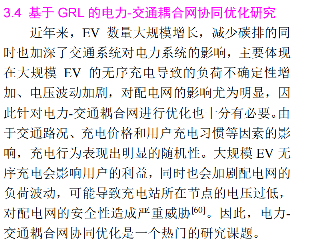
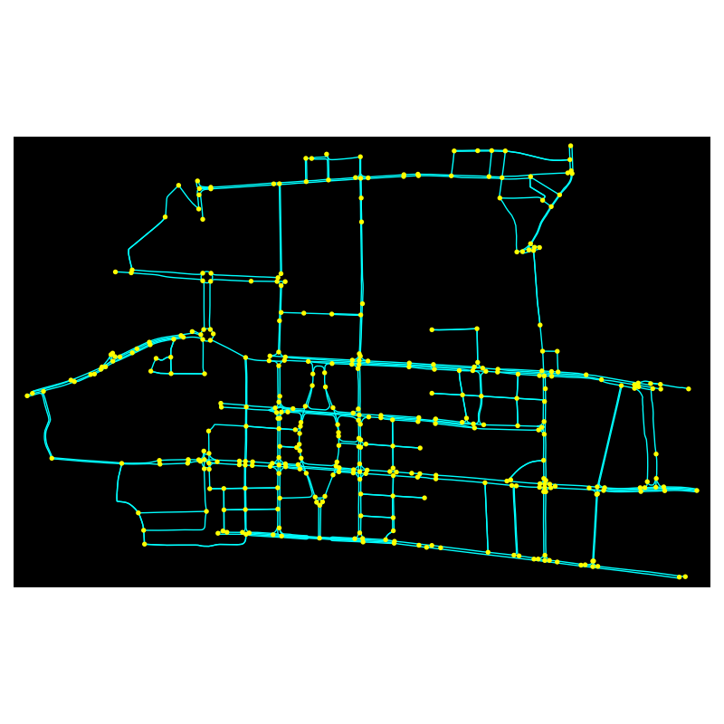

<!-- _class: lead -->

组会汇报 / 研究设想

# 面向真实路网的电动汽车充电协同调度研究
## 从文献梳理到研究方向凝练

关键词：真实路网｜协同调度｜闭环优化

  

    
一句话概括

    

      在真实城市路网下，研究<strong>车辆选站、站点排队与局部电网负荷</strong>之间的耦合关系，
      重点关注<strong>更合理的动态选站与协同优化</strong>。
    

  

  

    

      
<b>车</b>位置 / SOC / 出行

      
<b>路</b>拓扑 / 拥堵 / 时间

      
<b>站</b>排队 / 价格 / 容量

      
<b>网</b>负荷 / 电压 / 风险

    

  

汇报人：吴家鸿　导师：卢少锋

---

选题灵感

  

    
    
图：选题灵感

  

---

研究问题

# 1. 我想解决的核心问题是什么？

  

    <h3>现实中的充电决策</h3>
    <ul>
      <li>不是简单“找最近的站”</li>
      <li>会同时影响<strong>出行效率、站点排队、电网负荷</strong></li>
      <li>单车最优选择，可能导致系统整体失衡</li>
    </ul>
  

  

    <h3>本课题关注的问题</h3>
    <ul>
      <li>在<strong>真实路网</strong>条件下动态分配充电站</li>
      <li>兼顾<strong>用户体验、站点运行、电网安全</strong></li>
      <li>避免局部拥堵、排队和负荷聚集</li>
    </ul>
  

本质上，这是一个<strong>车 - 路 - 站 - 网耦合的动态协同调度问题</strong>，而不是单一站点推荐问题。

[引用] Sun et al., 2019; Cui et al., 2021; Liu et al., 2022.

---

文献认识

# 2. 现有研究已经做到什么？还缺什么？

文献 1Battery Health-Informed and Policy-Aware Deep Reinforcement Learning for EV-Facilitated Distribution Grid Optimal Policy

  

    <h3>目前进展</h3>
    <ul>
      <li>已能用深度强化学习实现 EV 充放电调度。</li>
      <li>已将 EV 纳入配电网联合优化框架。</li>
      <li>开始从“只看充电成本”转向“兼顾电网运行”。</li>
      <li>验证了在线调度能力和一定可扩展性。</li>
    </ul>
  

  

    <h3>目前不足</h3>
    <ul>
      <li>仍偏集中式，难兼顾用户自主性与隐私。</li>
      <li>个体 EV 对系统策略的真实响应难保证。</li>
      <li>大规模场景下实时决策压力较大。</li>
      <li>对真实道路交通等因素考虑仍有限。</li>
    </ul>
  

[引用] Xie et al., 2025.

---

文献认识

# 2. 现有研究已经做到什么？还缺什么？

文献 2Shortest-Path-Based Deep Reinforcement Learning for EV Charging Routing Under Stochastic Traffic Condition and Electricity Prices

  

    <h3>目前进展</h3>
    <ul>
      <li>已把充电路径问题建成随机环境下的在线决策。</li>
      <li>实现了“走哪条路 + 去哪个站充电”的统一建模。</li>
      <li>可在交通状态、电价波动等条件下动态决策。</li>
      <li>体现了路径与补能过程的耦合。</li>
    </ul>
  

  

    <h3>目前不足</h3>
    <ul>
      <li>更偏单车路径选择，对电网侧协同较少。</li>
      <li>对电池健康和长期退化未深入建模。</li>
      <li>大规模场景下仍面临状态空间压力。</li>
      <li>对多车竞争和系统级负荷均衡讨论不足。</li>
    </ul>
  

[引用] Jin & Xu, 2022.

---

文献认识

# 2. 现有研究已经做到什么？还缺什么？

文献 3Deep Reinforcement Learning for EV Charging Navigation by Coordinating Smart Grid and Intelligent Transportation System

  

    <h3>目前进展</h3>
    <ul>
      <li>将 EV 充电导航建模为随机环境下的 MDP。</li>
      <li>结合路况、价格和等待时间做在线选站与路径决策。</li>
      <li>不依赖不确定性先验，可适应随机变化。</li>
      <li>在实际城市原型场景中验证了有效性。</li>
    </ul>
  

  

    <h3>目前不足</h3>
    <ul>
      <li>主要从单车视角出发，未刻画多车竞争。</li>
      <li>场景规模较小，可扩展性仍需进一步证明。</li>
      <li>对配电网运行约束与电池老化考虑不足。</li>
      <li>随机环境建模仍偏理想化。</li>
    </ul>
  

[引用] Qian et al., 2020.

---

归纳总结

# 3. 从文献里，我归纳出的两个关键不足

  

    <h3>不足 1：缺少闭环</h3>
    <ul>
      <li>有的工作偏交通侧，只解决“去哪充、怎么走”</li>
      <li>有的工作偏电网侧，只关注系统层联合优化</li>
      <li>真正把<strong>交通、站点、电网</strong>贯通起来的闭环框架还不够多</li>
    </ul>
  

  

    <h3>不足 2：缺少系统协调</h3>
    <ul>
      <li>不少研究仍偏单车或单侧优化</li>
      <li>对多车竞争导致的<strong>排队、拥堵、负荷聚集</strong>考虑不足</li>
      <li>难以回答“系统整体会不会更好”这个问题</li>
    </ul>
  

所以我后续更想抓住两点：<strong>闭环优化</strong>，以及<strong>系统协调</strong>。

---

研究方向

# 4. 我目前初步选定的研究方向

  

    面向<strong>真实路网</strong>的电动汽车充电协同调度：
    在交通、站点和电网约束共同作用下，研究更合理的<strong>动态选站与协同优化</strong>。
  

  

重点 1
<strong>真实路网</strong> 让路径可达关系、拥堵传播和出行代价更贴近实际

  

重点 2
<strong>协同调度</strong> 不只看单车最优，还关注站点排队和局部电网负荷

  

重点 3
<strong>闭环优化</strong> 把选站决策与站点执行、电网反馈衔接起来

这次组会先把主线收敛到<strong>真实路网 + 协同调度 + 闭环优化</strong>，后续再考虑其他扩展问题。

---

总体思路

# 5. 目前拟采用的总体思路

  

输入
车辆位置 / SOC 路网状态 站点排队 / 价格 电网负荷反馈

  

决策
结合图结构表示空间关联 输出目标站点或候选站点排序

  

反馈
根据排队、负荷、电压等指标 形成下一轮调度修正

  

    <h3>想解决的问题</h3>
    “推荐哪个站”往往不够，关键在于<strong>能否在系统层面更合理</strong>。
  

  

    <h3>希望达到的效果</h3>
    同时改善<strong>用户体验、站点拥堵和局部电网运行</strong>。
  

---

研究计划

# 6. 接下来准备怎么推进

  

    <h3>阶段一</h3>
    <ul>
      <li>把真实路网场景搭起来</li>
      <li>统一车辆、站点、电网状态描述</li>
      <li>先形成可运行的基础环境</li>
    </ul>
  

  

    <h3>阶段二</h3>
    <ul>
      <li>实现动态选站与协同调度方法</li>
      <li>与现有单车/单侧方法做对比</li>
      <li>验证是否能缓解排队与负荷聚集</li>
    </ul>
  

  

    <h3>阶段三</h3>
    <ul>
      <li>在主线跑通后再考虑进一步扩展</li>
      <li>例如羊群效应抑制、隐私保护等</li>
      <li>避免前期研究主线过于发散</li>
    </ul>
  

---

# 7. 目前我是怎么建模的？

  

    <h3>系统架构：车 - 路 - 站 - 网 - 边</h3>
    <ul>
      <li><strong>交通网</strong>：真实路网图，路段时间随流量动态变化</li>
      <li><strong>配电网</strong>：辐射型配电网，站点负荷映射到母线节点</li>
      <li><strong>充电站</strong>：交通服务节点 + 电力负荷节点双重角色</li>
    </ul>
  

  

    <h3>交通侧成本建模</h3>
    <ul>
      <li><strong>广义成本</strong> = 行驶时间 + 站内服务时间 + 充电费用</li>
      <li><strong>行驶时间</strong>：采用 BPR 函数描述拥堵下的时变通行时间</li>
      <li><strong>服务时间</strong>：排队等待 + 实际充电时间</li>
      <li><strong>充电费用</strong>：由实时电价和补能需求共同决定</li>
    </ul>
  

---

  

    <h3>电网侧建模</h3>
    <ul>
      <li>采用 <strong>DistFlow</strong> 描述辐射型配电网潮流</li>
      <li>跟踪节点负荷、电压偏移、线路损耗</li>
      <li>实时电价采用 <strong>TOU 均值 + 随机波动</strong> 的方式生成</li>
      <li>电网状态既是约束，也是对交通决策的反馈信号</li>
    </ul>
  

  

    <h3>联合优化目标</h3>
    <ul>
      <li>用户总出行与充电成本</li>
      <li>排队等待代价</li>
      <li>配电网运行成本</li>
      <li>负荷波动 / 峰谷差惩罚</li>
      <li>通信代价（作为隐私保护扩展项可选加入）</li>
    </ul>
  

当前建模不是只做“站点推荐”，而是把<strong>交通出行、站内服务、电网反馈和后续分布式扩展</strong>放进同一个协同框架里。

[建模依据] 车-路-站-网-边耦合架构、交通侧一体化成本、DistFlow 电网模型与联合优化目标，来自你上传的模型章初稿。

---

选题灵感

  

    
    
图：广州珠江新城真实地图

  

---

总结

# 8. 总结

  

    <h3>现阶段我想讲清楚的</h3>
    <ul>
      <li>这个问题不是简单的充电站推荐</li>
      <li>而是车、路、站、网耦合下的协同调度问题</li>
      <li>现有研究已有基础，但仍缺闭环和系统协调</li>
    </ul>
  

  

    <h3>当前收敛后的主线</h3>
    <ul>
      <li><strong>真实路网</strong></li>
      <li><strong>协同调度</strong></li>
      <li><strong>闭环优化</strong></li>
    </ul>
  

我后续会先把这条主线做扎实，再在此基础上考虑羊群效应和隐私保护等扩展方向。

